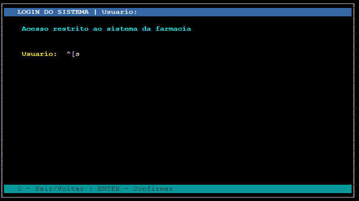
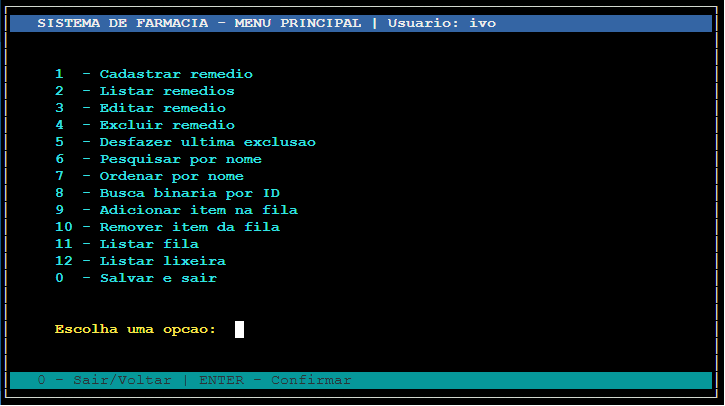
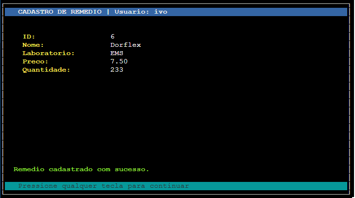
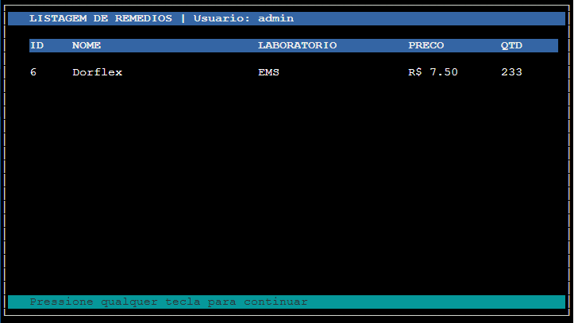
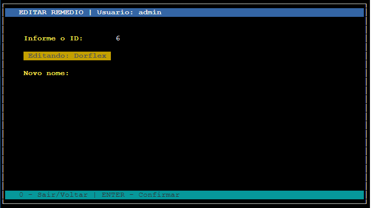
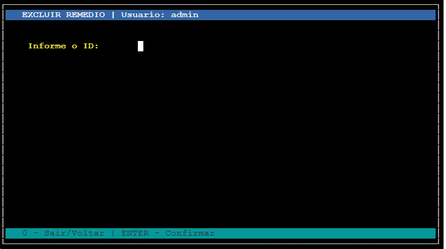
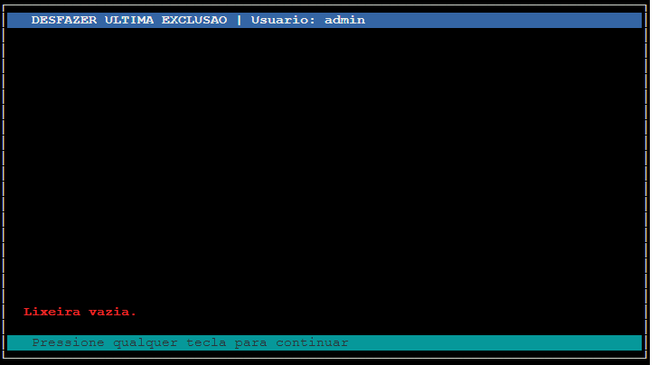

# Farmacia
Programa Didático de Cadastro de Remédios em C

    Recursos implementados:
    - Login com usuarios persistidos em arquivo
    - Cadastro principal usando Lista Encadeada
    - CRUD de remedios
    - Pesquisa sequencial por nome
    - Ordenacao por nome usando qsort sobre vetor de ponteiros
    - Busca binaria por ID usando vetor temporario ordenado
    - Lixeira usando Pilha
    - Fila de itens pendentes
    - Persistencia em arquivos binarios
    - Telas coloridas em modo texto com curses

    Compilacao Linux:
        gcc main.c -o farmacia -lncurses

    Compilacao Windows com PDCurses:
        gcc main.c -o farmacia.exe -lpdcurses
        
## Descrição
O programa utiliza a biblioteca ncurses/PDCurses, que é uma biblioteca clássica para criação de telas, menus e janelas coloridas em modo texto na linguagem C, para criação de um programa de cadastro de remédio de uma farmácia.

Os dados são persistidos no arquivo <b>usuarios.dat</b> (para os usuários do sistema) e <b>remedios.dat</b> (para o cadastro de remédios da farmácia).

---
### Login
O programa possui um controle de usuários básico. O programa possui 2 usuários padrão cadastrados:

|Usuario | Senha |
|--------|-------|
| admin  | 123   |
| ivo    | 123   |

No momento ambos usuários tem permissão para acessar todas as funcionalidades do sistema.

---
### Menu Principal
Tela principal do sistema onde o usuário possui acesso a todas as funcionalidades.

Possui as funcionalidades de:
- Cadastrar remédio
- Listar remédios
- Editar remédio
- Excluir remédio
- Desfazer última exclusão
- Pesquisar por nome
- Listar lixeira

---
### Tela Cadastro
Tela de cadastro de remédios. Solicta os campos:

- ID: código único do remédio. A rotina certifica-se de não existir um ID já cadastrado no banco de dados;
- Nome: string com o nome do remédio;
- Laboratório: string com o nome do laboratório fabricante do remédio;
- Preço: float com o preço unitário do remédio;
- Quantidade: inteiro com a quantidade em estoque do remédio;

---
### Tela Listagem do Cadastro
Tela de listagem do cadastro de remédios.

Exibe
- ID: código único do remédio;
- Nome: string com o nome do remédio;
- Laboratório: string com o nome do laboratório fabricante do remédio;
- Preço: float com o preço unitário do remédio;
- Quantidade: inteiro com a quantidade em estoque do remédio;

---
### Tela Editar Cadastro
Tela de edição do cadastro de remédios.

Solicita o ID do remédio, localiza o remédio na lista e permite a alteraçaõ dos dados.

---
### Tela de Exclusão de Remédio
Tela de exclusão de itens do cadastro de remédios.

Solicita o ID do remédio, localiza o remédio na lista e permite a exclusão dos dados.

---
### Tela Desfazer Ultima Exclusão
Tela que permite desfazer a última exclusão de um item do cadastro de remédios.

Solicita o ID do remédio, localiza na lista da lixeira e permite a exclusão dos dados.

