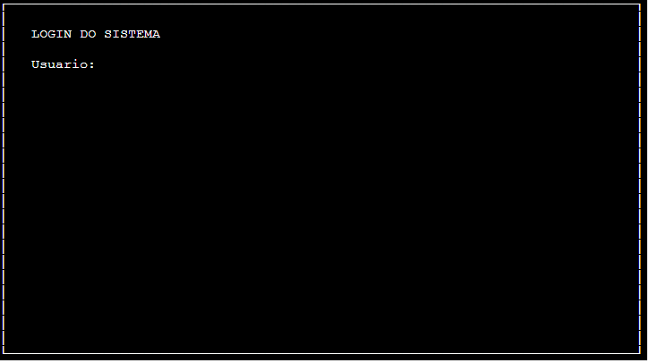
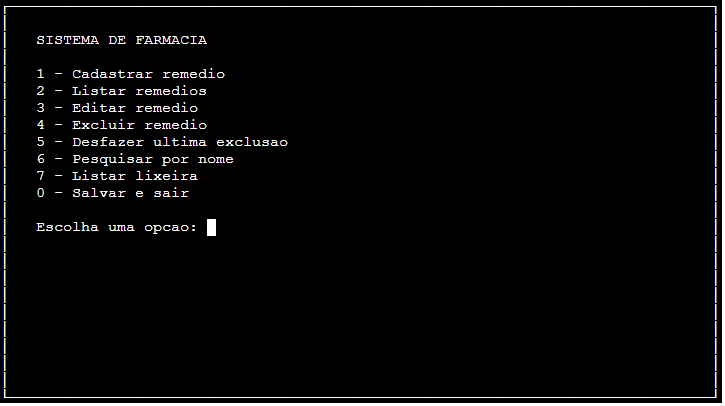

# Farmacia
Programa Didático de Cadastro de Remédios em C

## Descrição
O programa utiliza a biblioteca ncurses/PDCurses, que é uma biblioteca clássica para criação de telas, menus e janelas em modo texto na linguagem C, para criação de um programa de cadastro de remédio de uma farmácia.
Os dados são persistidos no arquivo usuarios.dat (para os usuários do sistema) e remedios.dat (para o cadastro de remédios da farmácia).

### Login
O programa possui 2 usuários padrão cadastrados:

|Usuario | Senha |
|--------|-------|
| admin  | 123   |
| ivo    | 123   |

### Menu Principal
Possui as funcionalidades de:
- Cadastrar remédio
- Listar remédios
- Editar remédio
- Excluir remédio
- Desfazer última exclusão
- Pesquisar por nome
- Listar lixeira

